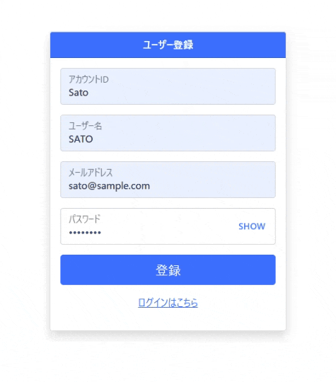
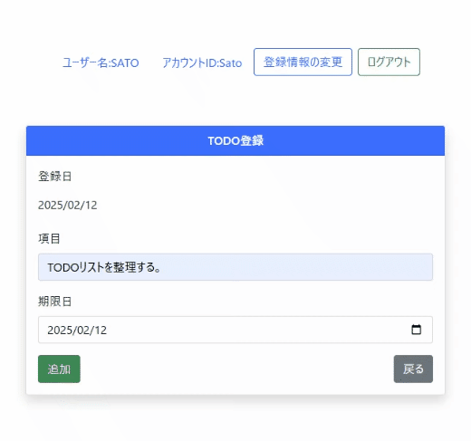
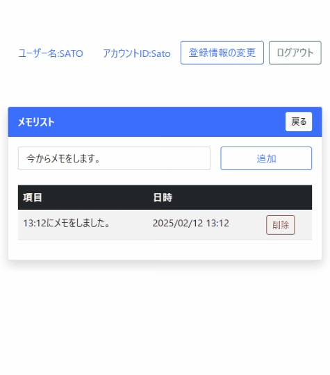
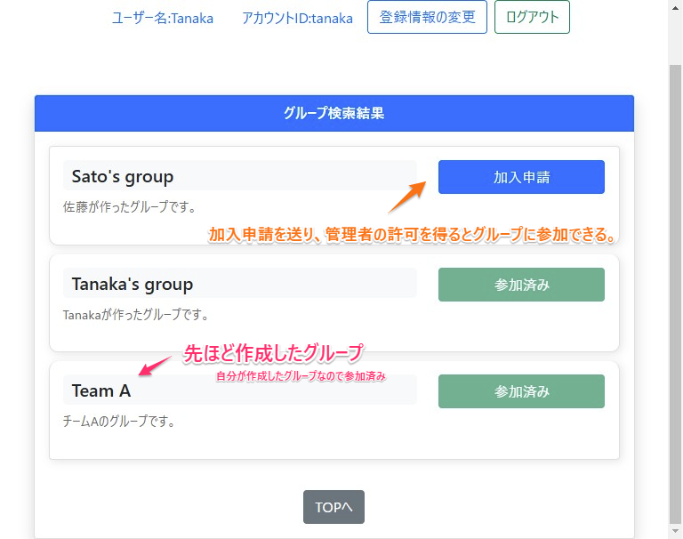

# Group TodoList

## プロジェクト概要
Group TodoList は、複数人のグループで共有する ToDo リストを管理するウェブアプリケーションです。グループ内でのタスク管理やメモ欄を付けることができます。

## 機能
- ユーザー登録、ログイン / ログアウト
- 個人ToDo メモ 一覧表示 / 登録 / 更新 / 削除
- グループ作成、メンバー招待 / 追加 / 削除
- グループ内の ToDo メモ 一覧表示 / 登録 / 更新 / 削除

## 使用技術
- **言語**: Java17
- **サーバー**: Tomcat 9
- **DB**: MySQL

## スクリーンショット

### 新規登録・ログイン

### TODO・MEMO操作
## TODO操作
 
## MEMO操作

### グループ
## グループ検索
!
## グループページ

## 管理者ぺージ

